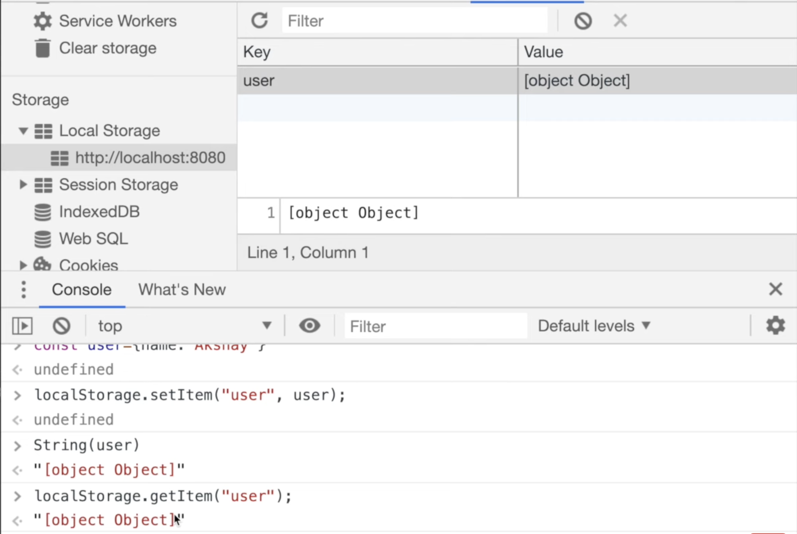
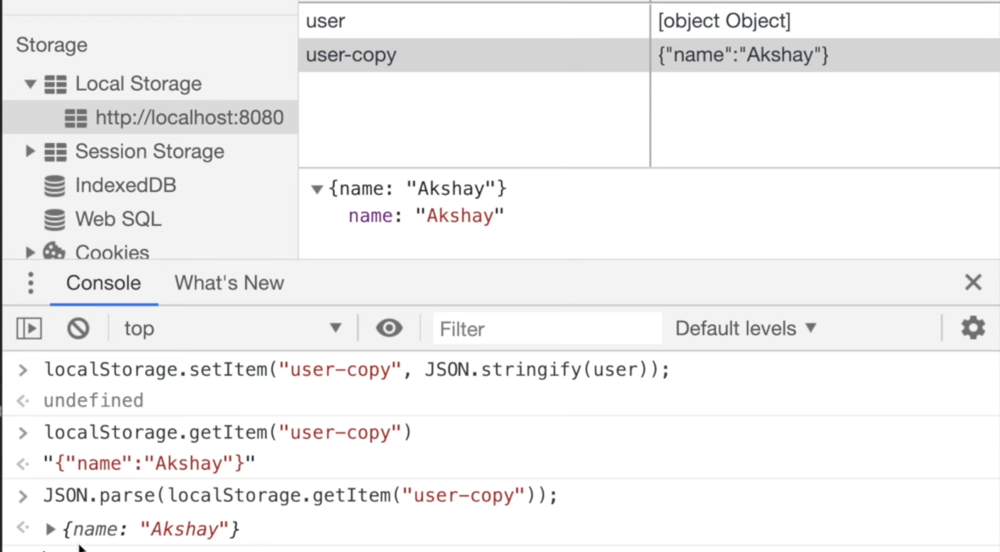
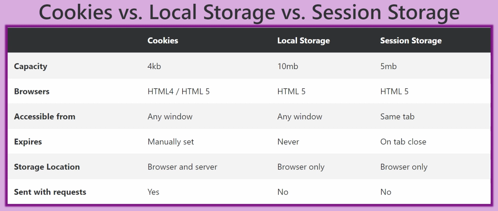

# Web Storage API

The **Web Storage API** is used by developers to store data in the browser as **key-value pairs**.

There are mainly two types of web storage:

1. `localStorage`
2. `sessionStorage`

---

# Types of Web Storage

## 1. Local Storage

- Data persists even after refreshing the page or restarting the browser.
- Data remains until it is manually removed.
- Storage limit is approximately **5MB to 10MB** depending on the browser.
- Data is stored on the user's browser only.
- Useful for storing non-sensitive client-side data.

### Common Use Cases

- Theme preference (dark/light mode)
- Recently visited pages
- Cart items
- User preferences

---

## 2. Session Storage

- Data exists only for the current browser tab/session.
- Data gets deleted when the browser tab is closed.
- Storage limit is approximately **5MB**.
- Data is not shared across tabs.

### Common Use Cases

- Multi-step form data
- Temporary session data
- OTP verification flow
- Temporary UI state

---

# Same Origin Policy

Web Storage APIs follow the **Same Origin Policy**.

An **Origin** consists of:

1. Protocol (`http` or `https`)
2. Domain/Host (`example.com`)
3. Port (`3000`, `8080`, etc.)

Example:

```txt
https://sekharsite.in:3000
```

| Part     | Value         |
| -------- | ------------- |
| Protocol | https         |
| Domain   | sekharsite.in |
| Port     | 3000          |

If any of these change, the browser treats it as a different origin.

For example:

```txt
https://sekharsite.in
http://sekharsite.in
```

These are considered different origins because the protocol changed.

---

# Accessing Local Storage

`localStorage` is available on the `window` object.

```js
window.localStorage;
```

Usually we directly use:

```js
localStorage;
```

---

# Local Storage Methods

## Store Data

```js
localStorage.setItem("username", "Sekhar");
```

---

## Get Data

```js
localStorage.getItem("username");
```

---

## Remove Specific Item

```js
localStorage.removeItem("username");
```

---

## Clear Entire Storage

```js
localStorage.clear();
```

---

# Important: Local Storage Stores Only Strings

Local Storage can store only strings.

---

## Problem Example

```js
const user = {
  name: "Sekhar",
};
```

If we store directly:

```js
localStorage.setItem("user", user);
```

It gets converted into:

```txt
[object Object]
```

because JavaScript converts objects into strings automatically.

---

# Correct Way to Store Objects

Use `JSON.stringify()` while storing.

```js
const user = {
  name: "Sekhar",
  role: "Frontend Developer",
};

localStorage.setItem("user", JSON.stringify(user));
```

---

# Getting Original Object Back

Use `JSON.parse()` while retrieving.

```js
const userData = JSON.parse(localStorage.getItem("user"));

console.log(userData.name);
```

Without `JSON.parse()`, the value will remain a string.

---

# What Happens If Key Does Not Exist?

```js
localStorage.getItem("randomKey");
```

Output:

```js
null;
```

---

# Example: Local Storage

```js
// Save user preference
localStorage.setItem("theme", "dark");

// Retrieve preference
const theme = localStorage.getItem("theme");

console.log(theme); // dark
```

---

# Example: Session Storage

```js
// Store temporary form data
sessionStorage.setItem("otpVerified", "true");

// Retrieve data
const status = sessionStorage.getItem("otpVerified");

console.log(status); // true
```

Once the browser tab is closed, this data is removed automatically.

---

# Creating Utility Functions

For cleaner code, developers often create reusable helper functions.

```js
function setLocalStorage(key, value) {
  localStorage.setItem(key, JSON.stringify(value));
}

function getLocalStorage(key) {
  const data = localStorage.getItem(key);

  return data ? JSON.parse(data) : null;
}
```

Usage:

```js
setLocalStorage("user", {
  name: "Sekhar",
  age: 25,
});

const user = getLocalStorage("user");

console.log(user);
```

---

# Cookies

Cookies are small pieces of data stored in the browser.

Unlike Local Storage and Session Storage, cookies are automatically sent to the server with every HTTP request.

---

# Features of Cookies

- Storage size is around **4KB**
- Stored in browser
- Can also be accessed by the server
- Expiration date can be configured manually
- Automatically included in HTTP requests
- Mainly used for:

  - Authentication
  - Session management
  - Tracking
  - Personalization

---

# Why Cookies Have Small Storage Size

Cookies are sent to the server with every request:

- HTML requests
- CSS requests
- Image requests
- API requests

If cookies become too large, network requests become slower.

That is why cookies have very limited storage capacity.

---

# Cookie Example

## Setting a Cookie

```js
document.cookie = "username=Sekhar";
```

---

## Setting Cookie With Expiry

```js
document.cookie = "username=Sekhar; expires=Fri, 31 Dec 2026 12:00:00 UTC";
```

---

## Setting Cookie With Path

```js
document.cookie =
  "username=Sekhar; expires=Fri, 31 Dec 2026 12:00:00 UTC; path=/";
```

---

## Reading Cookies

```js
console.log(document.cookie);
```

Output:

```txt
username=Sekhar
```

---

# Deleting a Cookie

To delete a cookie, set an old expiry date.

```js
document.cookie = "username=Sekhar; expires=Thu, 01 Jan 1970 00:00:00 UTC";
```

---

# Cookies and Authentication

Cookies are commonly used for authentication because they are automatically sent to the server.

Example flow:

1. User logs in
2. Server creates a session
3. Server sends session cookie
4. Browser stores the cookie
5. Browser automatically sends the cookie on future requests

This helps servers identify authenticated users.

---

# Types of Cookies

| Type               | Description                         |
| ------------------ | ----------------------------------- |
| Session Cookies    | Deleted when browser closes         |
| Persistent Cookies | Remain until expiry date            |
| Secure Cookies     | Sent only over HTTPS                |
| HttpOnly Cookies   | Cannot be accessed using JavaScript |
| SameSite Cookies   | Help prevent CSRF attacks           |

## path

- Defines where cookie is accessible.

```js
document.cookie = "username=Sekhar; path=/";
```

## secure;

- Cookie is sent only over HTTPS.

```js
document.cookie = "token=abc123; secure";
```

## SameSite

- Helps prevent CSRF attacks.

Mostly used values:

- Strict
- Lax
- None

Example:

```js
document.cookie = "token=abc123; SameSite=Strict";
```

## HttpOnly

### Very important.

1. Cannot be accessed using JavaScript
2. Only server can set it
3. Helps prevent XSS attacks

Frontend developers should know this conceptually.

You CANNOT do:

```js
document.cookie = "token=abc; HttpOnly";
```

because browser blocks JavaScript from creating HttpOnly cookies.

Usually backend sends:

```
Set-Cookie: token=abc123; HttpOnly; Secure
```

---

# Difference Between Local Storage, Session Storage, and Cookies

| Feature                 | Local Storage               | Session Storage         | Cookies        |
| ----------------------- | --------------------------- | ----------------------- | -------------- |
| Storage Limit           | 5MB–10MB                    | Around 5MB              | Around 4KB     |
| Expiry                  | Never expires automatically | Removed when tab closes | Configurable   |
| Accessible From Server  | No                          | No                      | Yes            |
| Sent With HTTP Requests | No                          | No                      | Yes            |
| Shared Across Tabs      | Yes                         | No                      | Yes            |
| Best Use Case           | Persistent client data      | Temporary session data  | Authentication |

---

# Important Notes

## Do Not Store Sensitive Data in Local Storage

Sensitive data like:

- JWT tokens
- Passwords
- Bank details

should generally not be stored in Local Storage because JavaScript can access it, making it vulnerable to XSS attacks.

---

# Which Storage Should We Use?

| Scenario                        | Recommended Storage |
| ------------------------------- | ------------------- |
| Theme preference                | Local Storage       |
| Temporary form state            | Session Storage     |
| Authentication/session handling | Cookies             |
| Recently visited pages          | Local Storage       |

---

> JavaScript automatically converts the object into a string using `.toString()`




